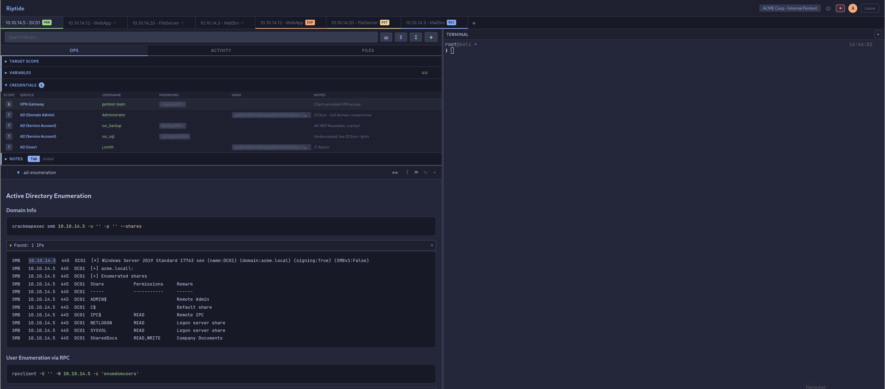

<div align="center">


**Collaborative terminal + playbook workspace for penetration testing engagements**

Riptide is a browser-based platform that combines a persistent PTY terminal with stackable markdown playbooks, real-time multi-user collaboration, and structured data management — all designed for offensive security workflows. Think of it as a shared war room where your team runs commands, documents findings, and manages credentials in one place.



</div>

---

## Highlights

**Terminal + Playbooks Side by Side**
A full xterm.js terminal on the right, stackable markdown note sections on the left. Fenced code blocks get Run buttons that execute directly in the terminal — click to run, capture the output, and it's saved back into your notes.

**Real-Time Collaboration**
Password-protected rooms with WebSocket sync. Multiple users see each other's presence, get live updates on notes/credentials/variables, and edit locks prevent conflicts. Late-joining users see buffered terminal output (up to 256KB per PTY).

**Playbook Library**
Build your own library of reusable playbooks organized by category and tags. Search, import into rooms, customize, and share across engagements.

**Variable Substitution**
Use `<TargetIP>`, `<Domain>`, or any custom variable in code blocks. Riptide scans your playbooks, renders input fields, and substitutes values at runtime. Variables support tab (per-target) and global (room-wide) scope — tab always overrides global.

**Credential Vault**
Store service/username/password/hash combos per target or globally. Click-to-reveal secrets, one-click copy, bulk export to `credentials.txt`/`usernames.txt`/`passwords_hashes.txt`. Flag interesting findings to alert the whole team.

**Output Intelligence**
After capturing terminal output, the parser automatically extracts IPs, URLs, emails, hashes, credentials, and nmap ports — highlighted inline with one-click promote actions to push findings into the credential vault or scope panel.

**Target Scope Tracking**
Per-tab scope panel for IP, hostname, OS, open ports, services, and notes. Tab status badges cycle through recon/exploit/post-exploit/pwned/blocked to track engagement progress at a glance.

**4 Catppuccin Themes**
Full theming support with all four Catppuccin flavors — Macchiato (default), Mocha, Frappe, and Latte. Every color in the app (5600+ CSS declarations, terminal, code editor) responds to theme changes instantly.

---

## Quick Start

### Prerequisites

- **Node.js** >= 18
- **npm** >= 9
- A system that supports [node-pty](https://github.com/nicedoc/node-pty) (Linux, macOS, Windows with build tools)

### Install & Run

```bash
git clone https://github.com/Real-Fruit-Snacks/Riptide.git
cd riptide
npm install
npm start
```

Open **https://localhost:3000** in your browser. Create a room, set a password, and you're in.

HTTPS is enabled by default — Riptide auto-generates a self-signed certificate on first launch (requires `openssl` on your PATH). Your browser will warn about the self-signed cert; accept it to proceed. To disable HTTPS and use plain HTTP instead:

```bash
NO_SSL=1 npm start
```

To use your own certificate:

```bash
SSL_KEY=/path/to/your.key SSL_CERT=/path/to/your.cert npm start
```

### Development

```bash
npm run dev        # Start with --watch (auto-restart on changes)
npm run lint       # ESLint (0 warnings policy)
npm test           # Run all 630 tests
npm run test:watch # Watch mode
```

---

## Architecture

Riptide is a vanilla JavaScript application with no build step — static files are served directly from `public/`. The backend is a modular Express server with WebSocket support for real-time sync and terminal I/O.

```
riptide/
├── server.js              # Express config, middleware, WebSocket, PTY management
├── lib/
│   └── storage.js         # File I/O, path resolution, atomic JSON updates
├── routes/                # 13 Express Router modules
│   ├── rooms.js           # Room CRUD, join/leave
│   ├── tabs.js            # Tab management, status, scope
│   ├── notes.js           # Playbook notes CRUD, ordering, severity
│   ├── credentials.js     # Credential vault (tab + global scope)
│   ├── variables.js       # Variable management (tab + global scope)
│   ├── scratch-notes.js   # Quick notes with severity
│   ├── history.js         # Command history per tab
│   ├── files.js           # File upload/download per tab
│   ├── playbooks.js       # Playbook library search, browse, import
│   ├── alerts.js          # Flagged finding alert history
│   ├── recordings.js      # Terminal session recording
│   ├── audit.js           # Audit log
│   └── session.js         # Session reset, cleanup
├── playbooks/             # User playbook library (.md files)
├── public/
│   ├── css/
│   │   ├── theme.css      # Catppuccin theme definitions (4 flavors)
│   │   └── style.css      # All application styles (~5700 lines)
│   ├── js/                # 35 frontend modules on Riptide.* namespace
│   │   ├── app.js         # Orchestrator — init, tab switching, layout
│   │   ├── terminal.js    # xterm.js instances, PTY WebSocket
│   │   ├── playbooks.js   # Note sections, edit/view, drag-reorder
│   │   ├── sync.js        # Real-time state sync via WebSocket
│   │   ├── auth.js        # Room creation/join, session tokens
│   │   ├── theme.js       # Theme switching, CSS var reads for JS
│   │   └── ...            # 29 more modules
│   ├── vendor/            # Served from node_modules (xterm, marked, etc.)
│   └── index.html         # Single page, script load order matters
└── test/                  # 630 tests across 25 files
    ├── unit/              # Pure logic tests
    ├── integration/       # HTTP endpoint + WebSocket tests
    └── helpers/           # Test factories, mock context, fixtures
```

### Dual WebSocket System

| Endpoint | Purpose |
|----------|---------|
| `/ws/terminal` | PTY I/O — stdin/stdout streaming, resize events, output buffering |
| `/ws/sync` | State broadcast — note edits, credential changes, presence, edit locks |

### Data Storage

Riptide stores engagement data on the filesystem. Each room can optionally specify a `workDir` — a path where all data lives organized by target:

```
{workDir}/
├── tabs.json                    # Tab config, variables
├── global-credentials.json      # Room-wide credentials
├── global-variables.json        # Room-wide variables
├── alerts.json                  # Flagged findings (capped at 200)
└── {TargetName}/                # Per-target folder
    ├── *.md                     # Playbook notes
    ├── credentials.json         # Target-scoped credentials
    ├── scratch-notes.json       # Quick notes
    └── credentials.txt          # Exported creds
```

---

## Tech Stack

| Layer | Technology |
|-------|------------|
| Server | Node.js, Express 4, WebSocket (ws) |
| Terminal | node-pty (server), xterm.js 5 (client) |
| Editor | CodeMirror 6 (markdown mode) |
| Markdown | marked + PrismJS syntax highlighting |
| Security | helmet, express-rate-limit, DOMPurify, scrypt hashing |
| Theming | Catppuccin via CSS custom properties |
| Testing | Vitest, supertest |
| Linting | ESLint 9 (flat config) |

No build step. No bundler. No framework. Just modules.

---

## Features at a Glance

| Feature | Description |
|---------|-------------|
| Persistent terminal | Full PTY with scrollback, web links, fit-to-container |
| Markdown playbooks | Stackable sections with Run buttons on code blocks |
| Run All | Execute every code block in a playbook sequentially |
| Output capture | Grab terminal output and save it back into your notes |
| Playbook library | Build, browse, search, and import your own templates |
| Variable system | `<VarName>` syntax with tab + global scope |
| Credential vault | Service/user/pass/hash per target or global, with export |
| Output parser | Auto-extract IPs, URLs, hashes, creds, ports from output |
| Target scope | IP, hostname, OS, ports, services per tab |
| Tab status | Recon/exploit/post-exploit/pwned/blocked badges |
| Finding alerts | Flag findings, team-wide toast + browser notifications |
| Scratch notes | Quick notes with severity levels per target |
| File management | Per-tab upload, drag-and-drop, gallery view |
| Terminal recording | Record and replay terminal sessions |
| Edit locking | Prevents concurrent edits on the same note |
| User presence | Avatars, tab presence dots, who's-where tracking |
| Keyboard shortcuts | Configurable hotkeys for common actions |
| Theme support | 4 Catppuccin flavors (Latte, Frappe, Macchiato, Mocha) |
| Audit log | Track room activity |
| Session management | Room admin controls, session reset |

---

## Security

Riptide is designed for use on trusted networks during authorized engagements.

- **Authentication**: scrypt password hashing (N=32768, r=8, p=2), 24-hour session expiry
- **TLS**: HTTPS by default with auto-generated self-signed certs, TLS 1.2 minimum
- **Transport**: helmet (CSP, HSTS, X-Frame-Options), WebSocket origin validation
- **Rate limiting**: 15 requests per 15 minutes on auth endpoints
- **Input sanitization**: DOMPurify on all rendered markdown, path traversal protection
- **Body limits**: 256KB request body limit

> **Warning**: Riptide is intended for internal/lab use during pentesting engagements. Do not expose it to the public internet without additional hardening (proper CA-signed certificates, reverse proxy, network-level access control).

---

## Configuration

Riptide uses sensible defaults with no config file required. Environment variables for customization:

| Variable | Default | Description |
|----------|---------|-------------|
| `PORT` | `3000` | Server port |
| `HOST` | `0.0.0.0` | Bind address |
| `NO_SSL` | *(unset)* | Set to `1` to disable HTTPS and use plain HTTP |
| `SSL_KEY` | `certs/server.key` | Path to TLS private key |
| `SSL_CERT` | `certs/server.cert` | Path to TLS certificate |

Theme selection is per-user via **Settings > General > Theme** and persists in localStorage.

---

## Creating Playbooks

Playbooks are markdown files in the `playbooks/` directory. Add frontmatter for metadata:

```markdown
---
title: Network Reconnaissance
description: Initial network enumeration and service discovery
category: Recon
tags: [nmap, network, enumeration]
---

## Host Discovery

```bash
nmap -sn <TargetSubnet>
```

## Port Scan

```bash
nmap -sCV -p- <TargetIP> -oN nmap_full.txt
```
```

Variables like `<TargetIP>` are detected automatically and rendered as input fields in the UI.

---

## Testing

```bash
npm test                    # All 630 tests
npm run test:unit           # Unit tests only
npm run test:integration    # Integration tests only
npm run test:coverage       # With V8 coverage report
npx vitest run -t "pattern" # Run tests matching a name
```

Tests are fully isolated — each test file creates its own temp directory and cleans up after itself.

---

## Contributing

1. Fork the repository
2. Create a feature branch (`git checkout -b feature/my-feature`)
3. Make your changes
4. Run `npm run lint && npm test` (both must pass with 0 warnings/failures)
5. Commit with a descriptive message
6. Open a Pull Request

### Code Style

- Vanilla JS on the `Riptide.*` namespace — no frameworks, no bundler
- ESLint with 0-warning policy
- Hover-reveal pattern for action buttons (hidden until parent hover)
- Delete confirmations on all destructive actions
- All REST mutations broadcast via WebSocket for real-time sync

---

## License

MIT